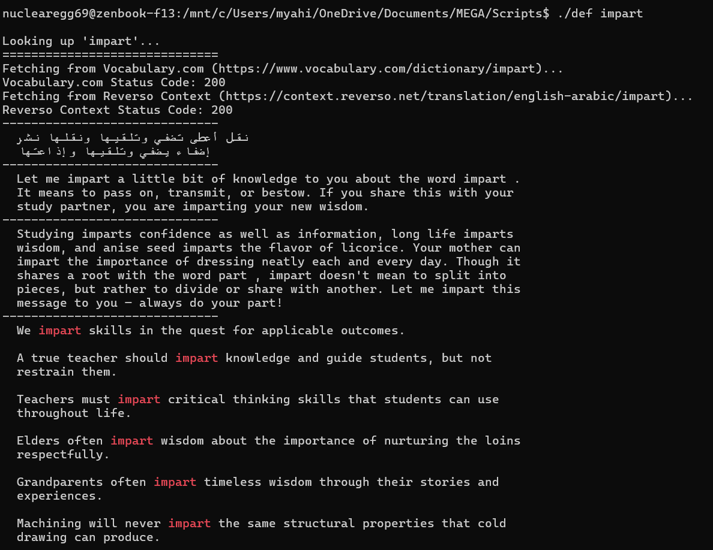
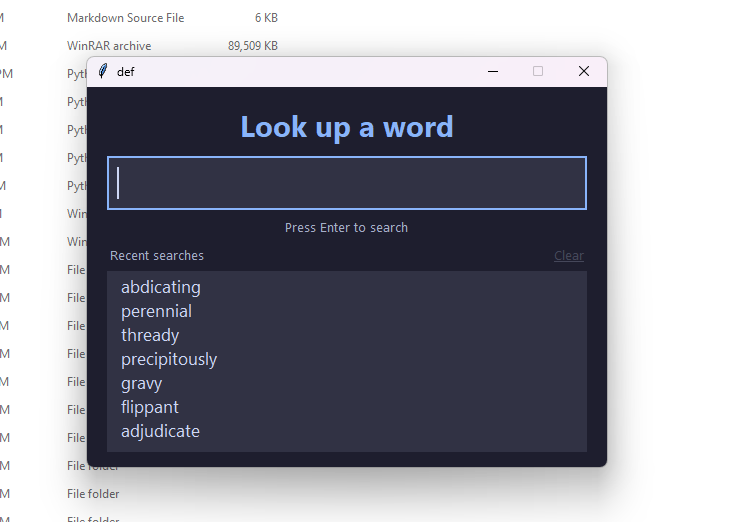

<div align="center">
  
  <h1>def (Hotkey Dictionary)</h1>
  <p>A distraction-free, fast dictionary and translation tool.</p>
</div>

---

## 🚀 Overview

**def** is a high-speed, hotkey-driven utility for students, developers, and avid readers to quickly look up English definitions and Arabic translations without breaking focus. 

Instead of opening a browser, navigating to multiple cluttered websites, and typing your search twice, **def** aggregates the best data into a single, clean window that disappears as soon as you're done.

## ✨ Key Features

- **Global Hotkey (`Ctrl+Alt+W`):** Instantly bring up the search window from any application.
- **Clipboard Lookup (`Ctrl+Alt+D`):** Highlight a word, hit the shortcut, and promptly see the definition.
- **Top-Tier Definitions:** Retrieves high-quality, comprehensive English definitions and explanations from [Vocabulary.com](https://www.vocabulary.com/).
- **Accurate Translations & Examples:** Fetches Arabic translations and real-world usage examples from [Reverso Context](https://context.reverso.net/).
- **Smart Copy (`Ctrl+C`):** Instantly copy a formatted summary of the word, its translations, and definitions straight to your clipboard—perfect for note-taking.
- **Zero-Distraction UI:** A sleek, dark-themed (Catppuccin Mocha) interface that stays out of your way.

## 📸 Evolution

From a simple terminal-based lookup tool to a refined, hotkey-driven GUI:

| **V1: Terminal (April 2025)** | **V2: Modern GUI that Spawns With a Hotkey (June 2026)** |
|:---:|:---:|
|  |  |

## 🛠️ Build Instructions

To build the executable yourself using PyInstaller, follow these steps:

1. **Create a Virtual Environment:**
   ```powershell
   python -m venv .venv
   ```

2. **Activate the Virtual Environment:**
   ```powershell
   .\.venv\Scripts\Activate.ps1
   ```
   *Note: If you get an error saying "scripts is disabled on this system," run `Set-ExecutionPolicy -ExecutionPolicy RemoteSigned -Scope Process` first.*

3. **Install Dependencies:**
   ```powershell
   pip install -r requirements.txt
   ```

4. **Build the Executable:**
   ```powershell
   pyinstaller --clean def.spec
   ```
   The output will be in the `dist/` directory.

## ⚠️ Disclaimer & Terms of Use

This application is an unofficial, open-source tool created for **personal and educational use only**. It aggregates data from Vocabulary.com and Reverso Context via web scraping. By using this tool, you agree to respect the [Terms of Service of Vocabulary.com](https://www.vocabulary.com/terms/) and [Reverso Context](https://www.reverso.net/disclaimer.aspx). The creators of this application are not affiliated with, endorsed by, or sponsored by these platforms.

---
<div align="center">
  <i>Built with Python & Tkinter</i>
</div>
